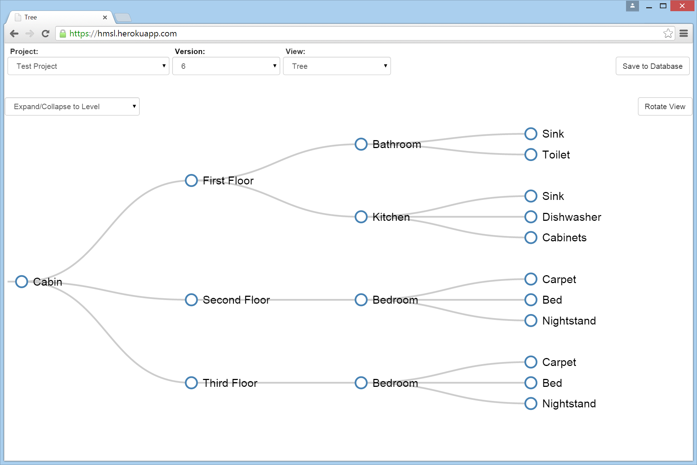
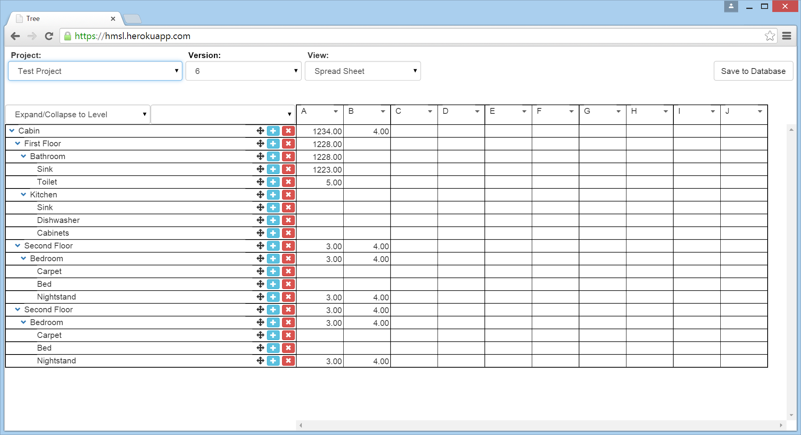

# hmsl
Hierarchy management system designed for mass properties management, but useful for any hierarchichal system

Allows easy manipulation of hierarchies.  Properties can be added to each node.  Those properties are tracked and aggregate up the hierarchy.  Previous versions of each project can be recalled and edited at any time.

Demo can be found here: https://hmsl.herokuapp.com

